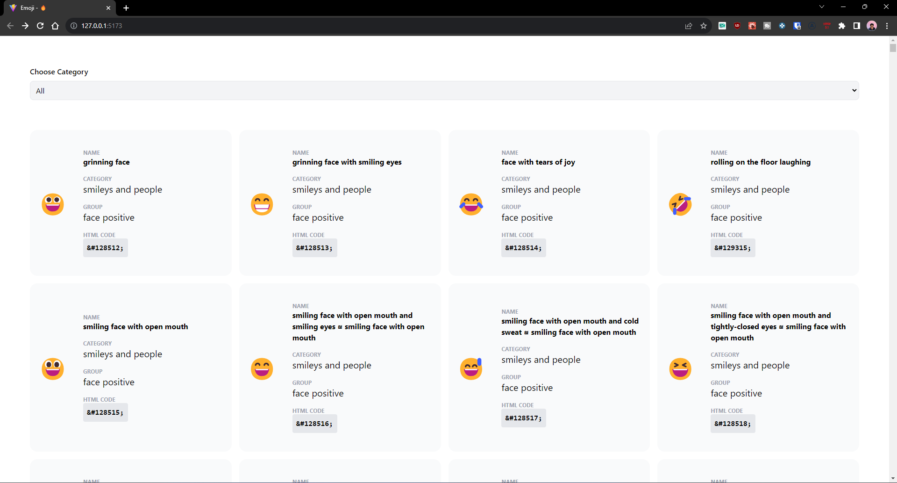
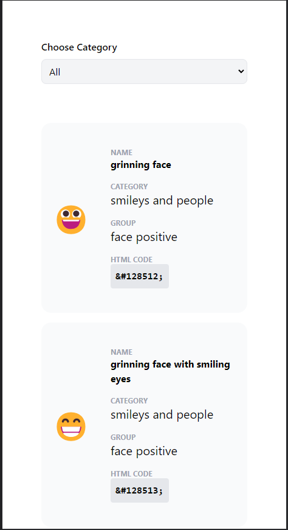

# Emoji Hub

<div class="file-problem complete-problem-statement black-333"><p>Develop a pseudo front end application that lets users conveniently list and browse all emojis.</p>
<p><strong>[Minimum requirement]</strong>&nbsp; (Entry-level)</p>
<ul>
<li>Use of Web API to fetch emoji details. ✅</li>  
<li>Utilize Response parameters: [name, category, group, htmlCode] ✅</li>
<li>Implement functionality to list the HTML code of emojis on a web page.✅</li>
<li>The design should be responsive for mobile, tablet, and desktop views.✅</li>
<li>Visually interactive design to list​ the other details.✅</li>
<li>
<p>Display all emojis in the card layout with all the response parameters.✅</p>
</li>
<li>
<p>Submit <strong>Screenshots, Source codes, and instructions </strong>in a ZIP file.✅</p>
</li>
</ul>
<p><strong>[Plus point]</strong> (Intermediate)</p>
<ul>
<li>A feature to filter the emojis by "category"✅</li>
<li>Pagination feature to list 10 emojis on a page.❌</li>
</ul>
<p><strong>[Guide]</strong></p>
<ul>
<li>Emoji&nbsp; API: <a href="https://emojihub.yurace.pro/api/all" target="_blank"><u>https://emojihub.yurace.pro/api/all</u></a></li>
</ul>
<p><strong>Note</strong>: Use this API to Fetch Emoji details.</p></div>

## Steps to run the code

```shell
npm install
npm run dev
```

## Screenshots

### Desktop



### Mobile


